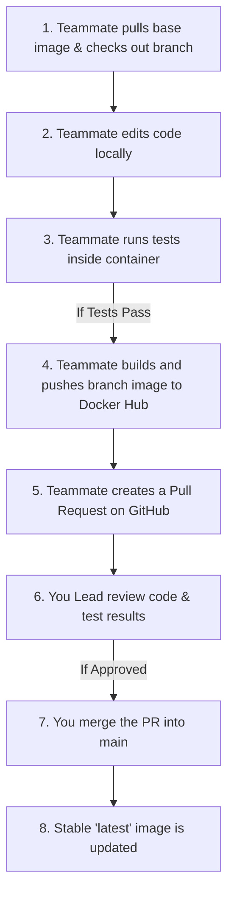

# 👥 OpsOracle Custom DevSecOps Team Workflow Guide

Here is the exact, step-by-step collaboration workflow designed for your team. This workflow ensures high code quality by requiring developers to **test locally, build, and push branch-specific images** to Docker Hub before their code can be merged into `main`.

---

## 🗺️ Visual Team Workflow



---

## 🛠️ Step-by-Step Developer Workflow

### Step 1: Clone & Checkout Branch
When a teammate starts a new task:
1. They pull the latest Docker image to ensure they have the latest base dependencies:
   ```bash
   docker pull sumitroydocker/project-root-backend:latest
   ```
2. They checkout a new branch for their task:
   ```bash
   git checkout -b feature/your-task-name
   ```

---

### Step 2: Edit Code and Test Locally
1. The developer writes their code in their IDE.
2. They run the containers locally using Docker Compose to verify their changes:
   ```bash
   docker compose up
   ```
3. They execute their test suite inside the container to make sure they didn't break anything:
   ```bash
   docker compose exec backend pytest
   ```

---

### Step 3: Build & Push the Branch Image to Docker Hub
Once the developer confirms their local test results are **correct**, they build and publish their branch image so that you and other teammates can pull and inspect it:

1. **Build their updated local image:**
   ```bash
   docker compose build
   ```
2. **Tag the image with their specific branch name:**
   *(For example, if their branch is named `feature/trivy-fix`)*:
   ```bash
   docker tag project-root-backend:latest sumitroydocker/project-root-backend:feature-trivy-fix
   ```
3. **Push the branch-specific image to Docker Hub:**
   ```bash
   docker push sumitroydocker/project-root-backend:feature-trivy-fix
   ```
   * **Why this is great:** This uploads their verified work to Docker Hub under their branch tag **without** overwriting or affecting the stable `:latest` image!

---

### Step 4: Open a GitHub Pull Request (PR)
1. The teammate pushes their Git branch to GitHub:
   ```bash
   git push origin feature/your-task-name
   ```
2. They open a Pull Request (PR) on GitHub from `feature/your-task-name` to `main`.
3. In their PR description, they link to their branch's Docker image tag on Docker Hub so you know exactly which built image goes with their code.

---

### Step 5: Review & Merge (Lead Action)
As the **Lead**, you review the code in the PR:
1. You can pull their branch image directly onto your computer to test it without needing to compile or run builds:
   ```bash
   docker pull sumitroydocker/project-root-backend:feature-trivy-fix
   ```
2. Once you verify their code and test results are correct, you **Merge** their Pull Request into the `main` branch.
3. You can then update the stable `:latest` image to point to this newly merged release:
   ```bash
   docker tag sumitroydocker/project-root-backend:feature-trivy-fix sumitroydocker/project-root-backend:latest
   ```

---

## 🔒 Security Best Practice: Docker Hub Permissions

Because your teammates will be pushing to `sumitroydocker/project-root-backend`, they need permission to write to your Docker Hub repository. 

Here are the two best ways to handle this securely:

* **Option A: Docker Hub Organization (Recommended)**
  Create a free **Organization** on Docker Hub, move the `project-root-backend` repository under it, and invite your teammates. Give them "Write" permissions to the repository. This keeps your personal password completely secret.
* **Option B: GitHub Actions Automation (Most Secure)**
  They only push code to GitHub. A GitHub Actions workflow built by you will securely build the image and push it to Docker Hub using a single repository secret key. Teammates won't even need a Docker Hub account to publish!
